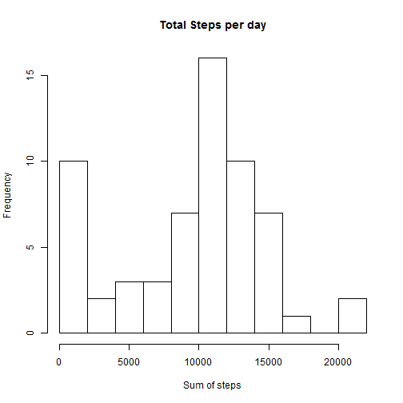
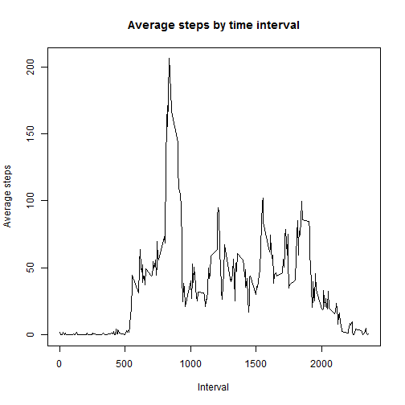
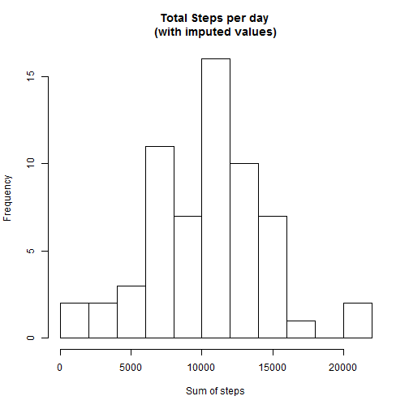
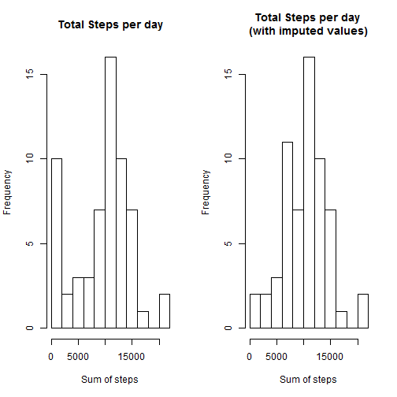
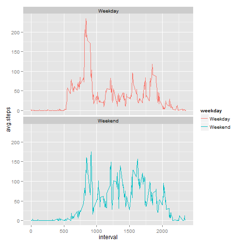

## Loading and preprocessing the data

We begin by loading required libraries for data cleaning and analysis.


```r
library(dplyr)
library(ggplot2)
```

Next, we load in the data, making sure it was done correctly by calling head(), and parsing the date column to the date class.


```r
activity.data <- read.csv("activity.csv")
head(activity.data)
```

```
##   steps       date interval
## 1    NA 2012-10-01        0
## 2    NA 2012-10-01        5
## 3    NA 2012-10-01       10
## 4    NA 2012-10-01       15
## 5    NA 2012-10-01       20
## 6    NA 2012-10-01       25
```

```r
activity.data$date <- as.Date(activity.data$date, "%Y-%m-%d")
```


## What is mean total number of steps taken per day?


To answer this question, we first extract the values desired, then plot the data.


```r
day.totals <- summarise(group_by(activity.data, date), 
                        step.sum=sum(steps, na.rm=TRUE))
hist(day.totals$step.sum, main="Total Steps per day", breaks=15, xlab="Sum of steps")
```

 

We then extract the values of the mean and median.


```r
mean(day.totals$step.sum)
```

```
## [1] 9354.23
```

```r
median(day.totals$step.sum)
```

```
## [1] 10395
```


## What is the average daily activity pattern?


To answer this question, we again extract the desired data, then plot a time series of the data.


```r
interval.avg <- summarise(group_by(activity.data, interval), 
                        avg.steps=mean(steps, na.rm=TRUE))
plot(interval.avg, type="l", main="Average steps by time interval", ylab="Average steps", xlab="Interval")
```

 

And we find the interval of the maximum value, as well as the value


```r
max.index <- which.max(interval.avg$avg.steps)
interval.avg[max.index,]
```

```
## Source: local data frame [1 x 2]
## 
##   interval avg.steps
## 1      835  206.1698
```


## Imputing missing values


We look at the total number of missing values in the data.


```r
sum(is.na(activity.data$steps))
```

```
## [1] 2304
```

And we then impute values by taking the average of that interval over all days calculated.


```r
imputed.missing <- activity.data

for (ii in 1:nrow(activity.data)) {
    if (is.na(activity.data$steps[ii])) {
        imputed.missing$steps[[ii]] <- floor(interval.avg$avg.steps[
            (imputed.missing$interval[[ii]] / 5) + 1])
    }
}
```

We then see the impact that imputed values had by reanswering the first question with the imputed values.


```r
imputed.totals <- summarise(group_by(imputed.missing, date), 
                        step.sum=sum(steps, na.rm=TRUE))
hist(imputed.totals$step.sum, main="Total Steps per day \n(with imputed values)", breaks=15, xlab="Sum of steps")
```

 

And we compare it to the first plot.


```r
par(mfrow=c(1,2))
hist(day.totals$step.sum, main="Total Steps per day", breaks=15, xlab="Sum of steps")
hist(imputed.totals$step.sum, main="Total Steps per day \n(with imputed values)", breaks=15, xlab="Sum of steps")
```

 

And look at the mean and median with the imputed values included.


```r
mean(imputed.totals$step.sum)
```

```
## [1] 10272.13
```

```r
median(imputed.totals$step.sum)
```

```
## [1] 10395
```


## Are there differences in activity patterns between weekdays and weekends?


To begin with answering this question, we create a new variable, telling us whether or not a date is a weekend or weekday, and extract the necessary values.


```r
activity.data$weekday <- factor(weekdays(activity.data$date) 
                                %in% c("Saturday", "Sunday"), labels=c("Weekday", "Weekend"))
interval.avg.grouped <- summarise(group_by(activity.data, interval, weekday), 
                          avg.steps=mean(steps, na.rm=TRUE))
```

We then plot the comparison of the data.


```r
ggplot(data=interval.avg.grouped, aes(x=interval, y=avg.steps, col=weekday), 
       main="Average steps per interval by weekend and weekday", xlab="Interval", 
       ylab="Average number of steps") + 
    geom_line() + facet_wrap(~weekday, ncol = 1)
```

 

And we are finished. 
